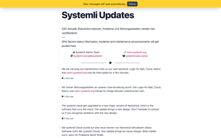
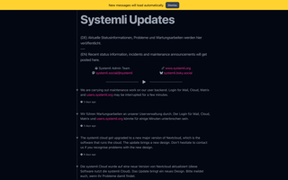
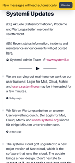
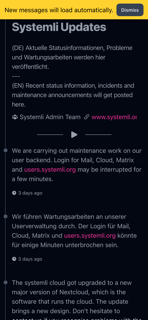

# ticker-frontend

[](https://github.com/systemli/ticker-frontend/actions/workflows/integration.yaml) [](https://sonarcloud.io/summary/new_code?id=systemli_ticker-frontend) [](https://sonarcloud.io/summary/new_code?id=systemli_ticker-frontend) [](https://sonarcloud.io/summary/new_code?id=systemli_ticker-frontend)

This is the frontend for the [ticker project](https://github.com/systemli/ticker).
It provides a simple single page website to present your ticker.

## Getting started

### Prerequisites

- [Node.js](https://nodejs.org/en/) (>= v22.14.0, lts/jod)
- [Ticker](https://github.com/systemli/ticker) running on <http://localhost:8080>

### First start

1. Optional: Install NodeJS with nvm

    ```bash
    nvm use
    ```

2. Install dependencies

    ```bash
    npm install
    ```

3. Start the development server

    ```bash
    npm run dev
    ```

4. Open the website in your browser: <http://localhost:4000>

## Screenshots

[](assets/screenshot-desktop-default.png)
[](assets/screenshot-desktop-dark.png)

[](assets/screenshot-mobile-default.png)
[](assets/screenshot-mobile-dark.png)

## License

GPL-3.0 license. See [LICENSE](LICENSE) for more information.
