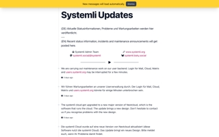
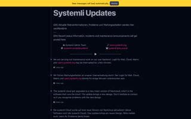
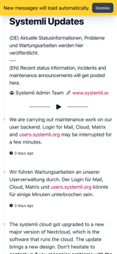
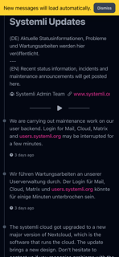

# ticker-frontend

[](https://github.com/systemli/ticker-frontend/actions/workflows/integration.yml)
[](https://sonarcloud.io/summary/new_code?id=systemli_ticker-frontend)
[](https://sonarcloud.io/summary/new_code?id=systemli_ticker-frontend)
[](https://sonarcloud.io/summary/new_code?id=systemli_ticker-frontend)

The public frontend for the [Ticker project](https://github.com/systemli/ticker). It presents a
single ticker as a live page, updating as new messages arrive.

It is a static single-page application and holds no data of its own; everything lives in the
[ticker](https://github.com/systemli/ticker) API.

## Documentation

**<https://systemli.github.io/ticker/>**

Installation, configuration, deployment and troubleshooting for the whole stack are documented
centrally:

- [Installation](https://systemli.github.io/ticker/installation/) — running the full stack with Docker
- [Configuration](https://systemli.github.io/ticker/configuration/)
- [Troubleshooting](https://systemli.github.io/ticker/troubleshooting/)

The published image is [`systemli/ticker-frontend`](https://hub.docker.com/r/systemli/ticker-frontend).

## Screenshots

[](assets/screenshot-desktop-default.png)
[](assets/screenshot-desktop-dark.png)

[](assets/screenshot-mobile-default.png)
[](assets/screenshot-mobile-dark.png)

## Development

**Requirements:** Node 24 (see `.nvmrc`) and a running [ticker](https://github.com/systemli/ticker)
API.

```shell
nvm use
npm install
npm run dev        # http://localhost:4000
```

The dev server proxies `/api` to `http://localhost:8080/v1`, so run the API alongside it and nothing
needs configuring.

> **Delete a leftover `.env`.** `TICKER_API_URL` overrides the proxy with an absolute address.
> Requests still work, but attachment images do not: their URLs are relative and would resolve
> against the dev server instead of the API. The file is gitignored, so an old one may still be in
> your checkout.

> **The ticker must know this address.** The API works out which ticker to serve from the request's
> `Origin` header, which the proxy sets to `http://localhost:4000`. That address has to be registered
> under the ticker's websites in the admin interface. Otherwise the page only ever shows "The ticker
> is currently inactive".

### Commands

```shell
npm test           # vitest, watch mode
npm run coverage
npm run lint
npm run build
npm run preview
```

Note the service worker is only registered in production builds, so PWA behaviour does not appear
under `npm run dev`.

See [AGENTS.md](AGENTS.md) for architecture and conventions, and the
[development guide](https://systemli.github.io/ticker/development/) for working across the three
repositories.

## Localization

Strings live in the [locales](./src/i18n/locales) folder. To add a language, update:

- [i18n.ts](./src/i18n/i18n.ts) to register it
- [MessageTime.tsx](./src/components/MessageTime.tsx) for `dayjs` relative times

Use the `t('stringKey')` notation for new strings and update all locales.

## Licence

GPL-3.0. See [LICENSE](LICENSE).
